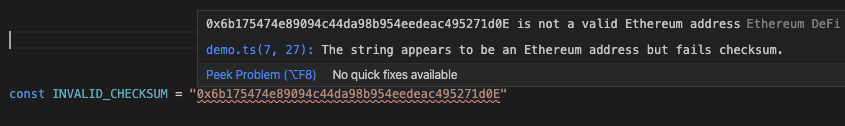
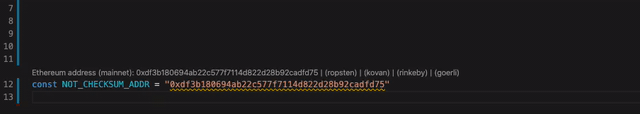

# Ethereum DeFi Language Support Demo

- Diagnostics and quick fixes for address checksum failures and non-checksum addresses.

 

- Code completion for Ethereum token addresses by name.
- Hover over token addresses for live data including price, market cap, and daily volumes.
- Code lens for Ethereum addresses with Etherscan links for mainnet and testnets.

- Hover over Ethereum addresses for live data including ETH/token balances and dollar values.
- Automatic ENS name resolution and reverse resolution.
- Quick fixes to convert addresses to ENS names and vice versa.

- Code snippets for DeFi applications such as pTokens and Uniswap v2 SDKs, and ERC20 Contract ABI.

 
 
 
