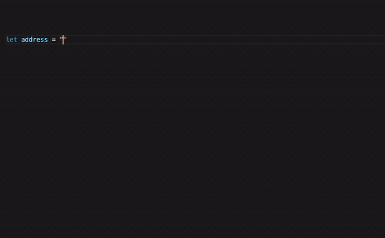
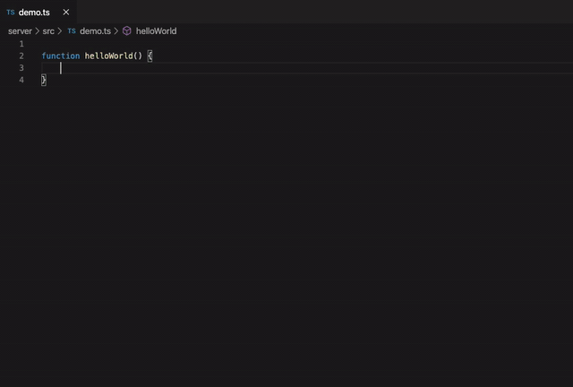
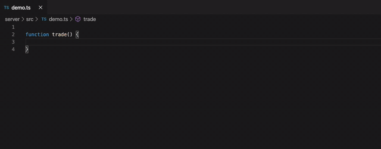
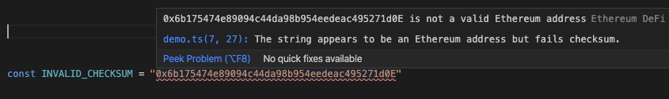
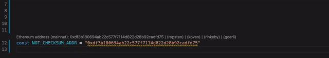

# Ethereum DeFi Language Support

Ethereum DeFi support for NodeJS applications in VS Code.

## Features

- Code completion for Ethereum token addresses by name.
- Hover over token addresses for live data including price, market cap, and daily volumes.
- Code lens for Ethereum addresses with Etherscan links for mainnet and testnets.

- Hover over Ethereum addresses for live data including ETH/token balances and dollar values.
- Automatic ENS name resolution and reverse resolution.
- Quick fixes to convert addresses to ENS names and vice versa.

- Snippets for DeFi applications such as pTokens and Uniswap v2 SDKs.

- Diagnostics and quick fixes for checksum failures and non-checksum addresses.

## Setup

To enable full functionality, go to VS Code settings, search for the following settings and enter the required values:
- Code Lens: Enable
- Infura: Enter your Infura Project ID and Project Secret from https://infura.io/
- Amberdata: Enter your Amberdata API key from https://amberdata.io/

The above secrets and API key are optional and are used by the extension to access additional APIs for enhanced display data.
