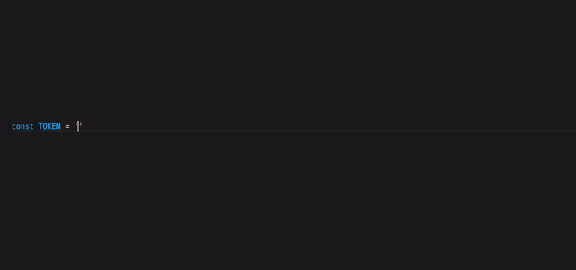

# Ethereum DeFi Language Support

Ethereum DeFi support for NodeJS applications in VS Code.

## Features

- Diagnostics and quick fixes for address checksum failures and non-checksum addresses.
- Code completion for Ethereum token addresses by name.
- Hover over token addresses for live data including price, market cap, and daily volumes.
- Code lens for Ethereum addresses with Etherscan links for mainnet and testnets.
- Hover over Ethereum addresses for live data including ETH/token balances and dollar values.
- Automatic ENS name resolution and reverse resolution.
- Quick fixes to convert addresses to ENS names and vice versa.
- Code snippets for DeFi applications such as pTokens and Uniswap v2 SDKs, and ERC20 Contract ABI.
- Highlight a contract address to generate ABI for Etherscan verified contracts.

Click [here](DEMO.md) for a demo of the above features.

## Setup

Go to the VS Code settings, search for the following settings and enter the required values:
- Code Lens: Enable
- Infura: Enter your Infura Project ID and Project Secret from https://infura.io/
- Amberdata: Enter your Amberdata API key from https://amberdata.io/
- Etherscan: Enter your Etherscan API key from https://etherscan.io/

The above secrets and API keys are not strictly required, but are needed if you want to enable full functionality of this extension.
